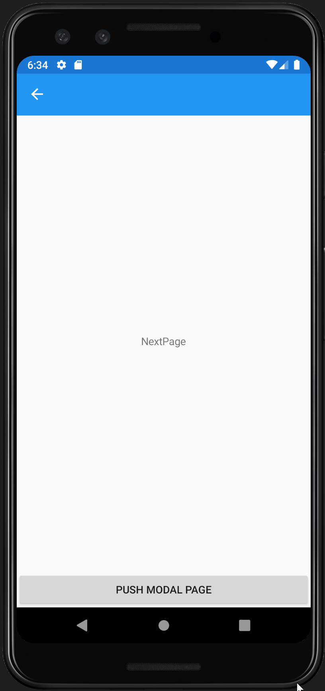
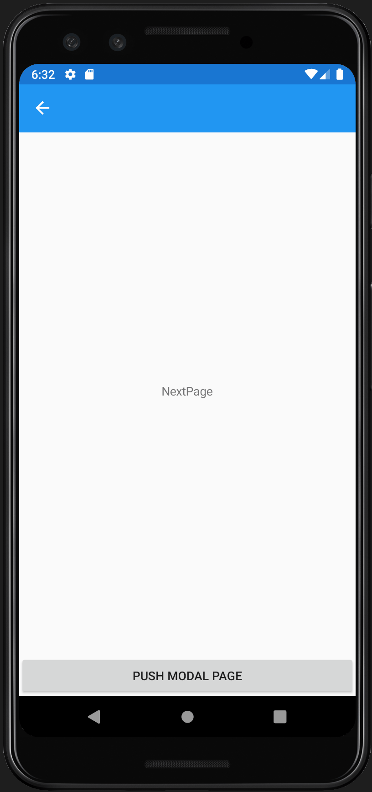
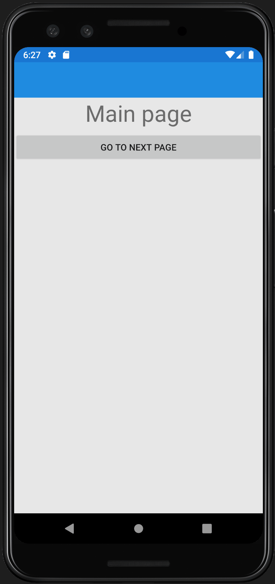

# ModalSample

This is a repo to demonstrate an issue that I think is a bug with
Xamarin.Forms.

The behaviour of the initial and second commit I would expect to be the same.

The second commit has the behaviour that I want 

- Modal navigation opens a new modal
- Popping a modal does not clear the navigation stack underneath
- Popping a modal, then immediately pushing another one will end with the new
  modal show, which if popped returns to the original stack.

However the initial commit (`broken` branch), using async await, does not.

- Popping a modal then immediately pushing another one returns to the "NextPage"

On another project, there is an additional issue where popping a modal returns
to the original main page of the application (disregarding the history in the
navigation stack underneath).

Using the latest prerelease versions (`prerelease-broken` branch) does not fix
the issue.

| `master` (working) | `broken` | `prerelease-broken` |
| --- | --- | --- |
|  |  |  |
